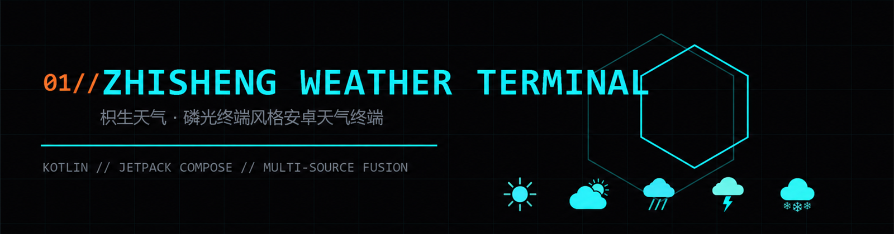
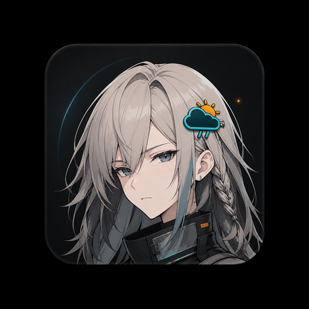

<p align="center">
  <br/>
  <b>Open it and get the weather.</b><br/>
  A dense, phosphor-terminal weather app for Android. No ads, accounts, or analytics SDK.
</p>

<p align="center">
  <a href="https://gitee.com/zhisheng8888/ZhishengWeather/releases">
    
  </a>
</p>

<p align="center">
  <a href="https://gitee.com/zhisheng8888/ZhishengWeather"></a>
  
  
  
  
</p>

<p align="center">
  <a href="README.md">简体中文</a> · <b>English</b>
</p>

---

## Screens

<table>
  <tr>
    <td align="center"><a href="assets/screenshot-home.jpg"></a></td>
    <td align="center"><a href="assets/screenshot-details.jpg"></a></td>
    <td align="center"><a href="assets/screenshot-cities.jpg"></a></td>
    <td align="center"><a href="assets/screenshot-add-city.jpg"></a></td>
    <td align="center"><a href="assets/screenshot-settings.jpg"></a></td>
  </tr>
  <tr>
    <td align="center"><sub>Home</sub></td>
    <td align="center"><sub>Telemetry &amp; air</sub></td>
    <td align="center"><sub>Cities</sub></td>
    <td align="center"><sub>Search</sub></td>
    <td align="center"><sub>Settings</sub></td>
  </tr>
</table>

<p align="center"><sub>Click a screenshot to open the full image.</sub></p>

## About the project

When I check the weather, I usually want four answers quickly: the current temperature, when rain is due, whether the air is decent, and whether the next few days will turn colder. Zhisheng Weather puts those answers in one vertical feed. There is no splash ad and no account screen.

The interface uses a phosphor-terminal look: black background, thin dividers, cyan for regular data, and orange for signals that need attention. Current conditions, alerts, hourly weather, and short-term precipitation come first. Air quality, life indices, and moon data follow below.

## What it shows

- Current conditions, feels-like temperature, wind, and pressure for your location or saved cities
- A 24-hour forecast, 15-day high/low outlook, and the next two hours of precipitation
- Weather alerts, six air-pollutant readings, and common life indices
- Sunrise, sunset, moon phase, moonrise, moonset, and yesterday's weather
- Saved cities and home-screen widgets in 2x2, 4x2, and 4x4 sizes
- Launcher shortcuts for refresh, city search, and settings

Rain, snow, fog, and thunderstorms each have an optional background effect. Intensity is adjustable, and every effect can be turned off. Temperature, wind-speed, and pressure units are configured separately. Page sections can also be hidden.

Fields that a provider does not supply stay empty; the app does not fill them with estimates.

## Public and full builds

Gitee Releases provide the public APK, which works immediately after installation. The full build must be compiled from source with your own QWeather developer credentials.

| | Public build | Full build |
|:--|:--|:--|
| Get it | Download from [Releases](https://gitee.com/zhisheng8888/ZhishengWeather/releases) | Clone and build the source |
| Default data path | Xiaomi Weather + Open-Meteo | QWeather first, with Xiaomi and Open-Meteo as supplements |
| Extra setup | None | QWeather Ed25519 credentials |
| Main difference | Everyday weather works out of the box | QWeather alerts, minute precipitation, and life indices are available according to account permissions |

The public build is the right choice for normal use. The full build cannot be distributed preconfigured because developer credentials do not belong in a public APK.

## Data providers

The app connects to QWeather, Xiaomi Weather, and Open-Meteo. Settings can select a provider manually or use Auto, and show which provider actually returned the selected city's data.

| Provider | Setup | Main coverage |
|:--|:--|:--|
| QWeather | Personal developer credentials | Current conditions, alerts, hourly/daily, minute precipitation, AQI, life indices |
| Xiaomi Weather | None | Weather in China, city search, yesterday's weather, and typhoon support data |
| Open-Meteo | None | Global current/hourly/daily, AQI, 15-minute precipitation, and gap filling |

Auto tries QWeather in a full build, then Xiaomi Weather and Open-Meteo. If the primary feed returns too few hourly entries, the app rebuilds the timeline in the city's local time and fills it to 24 hours with Open-Meteo. Daily forecasts use the same approach to reach 15 days.

Moon phase is calculated on-device for the selected city's date. If the provider does not return moonrise or moonset, the app calculates them from the date and coordinates without making another request.

QWeather requests use Ed25519-signed JWTs. The `-PpublicBuild` task clears the QWeather configuration during the build, so the public APK and repository contain no developer credentials.

## Icons

<p align="center">
  
</p>

The launcher icon uses three clear weather elements: sun, cloud, and rain. Its dark base and cyan-orange palette match the app interface.

<p align="center"></p>

The app also includes 15 custom weather glyphs for clear, cloudy, overcast, fog, rain, thunderstorms, snow, wind, and sleet. They were drawn for this project rather than assembled from a general icon library.

## Install

1. Download the latest public APK from [Releases](https://gitee.com/zhisheng8888/ZhishengWeather/releases).
2. Install it on Android 8.0 or later.
3. The first launch shows Beijing. Use search to save your own cities.

The APK is distributed through Gitee. Android may ask you to allow the current app to install unknown-source files. That prompt refers to the download channel; Zhisheng Weather is not requesting another system permission.

## Version 0.0.8

This update mainly fixes inconsistent weather display.

1. Fixed the home screen still saying "no rain" while it is raining
2. Fixed the hourly forecast labeling the next hour as "Now"
3. Improved short-term precipitation status so it no longer stays on "raining" after rain has stopped
4. Improved daily weather display: when day and night conditions differ, the more significant weather is shown, and the expanded row can show phrases such as "sunny turning to thunderstorms"
5. Fixed overcast being shown as light rain

Notifications are not included in this version.

## Version 0.0.6

Open the app and see the next two hours at a glance. A one-line briefing sits under the big temperature (when rain starts, alerts, tomorrow's swing). The precipitation card says "rain starts in X minutes". The public Xiaomi feed now includes the 120-minute nowcast series. Tap a daily row for sunrise, sunset, and moon data. MIUI forced-dark is disabled, and light theme no longer flashes black on cold start. Notifications are not in this release.

## Version 0.0.5

Version 0.0.5 is mostly about themes. Alongside dark mode there is now a "cold jade" light theme — cool gray paper with jade as the data color — and the widgets change skin with it. It also fixes two bugs that had been hiding in plain sight.

- Three theme modes — dark / light / follow system — applied instantly, widgets restyle to match
- Fixed follow-system showing the opposite of the system theme
- Fixed alerts from the QWeather provider ignoring the four-tier national color scale (they all showed red)
- Added an open-source repository link in Settings — stars welcome
- A full polish pass on light-mode text, icons, and the daily temperature bars

Release checks cover 46 unit tests, Android Lint, and Debug, public Release, and full Release builds.

## Version 0.0.5.1

A widget polish pass: date, update time, feels-like, and hourly/daily text got a size bump; the widget-picker previews are redrawn (sample city is now Shanghai, matching the real layouts); widgets now follow only the system dark mode — switching the in-app theme no longer restyles the desktop widgets.

## Build from source

You need JDK 17 and Android SDK 34. The Gradle Wrapper is included.

```bash
git clone https://gitee.com/zhisheng8888/ZhishengWeather.git
cd ZhishengWeather
```

Without credentials, the project builds the public data path. To use QWeather as the primary feed, put your SDK path and credentials in the root `local.properties`; the file is already ignored by Git.

```properties
sdk.dir=<Android SDK path>
qw.host=<API host>
qw.project_id=<Project ID>
qw.kid=<Key ID>
qw.private_key=<single-line Ed25519 private key>
```

```bash
./gradlew assembleDebug                     # Windows: .\gradlew.bat assembleDebug
./gradlew assembleRelease                   # full build; configure your own signing key
./gradlew assembleRelease -PpublicBuild     # public build; clears credentials and uses the in-repo public key
```

The bundled `keystore/public.jks` only keeps public builds upgrade-compatible with each other. It is not a private signing identity.

Main stack: Kotlin 2.0.21, Jetpack Compose, Material 3, ViewModel / StateFlow, Retrofit, OkHttp, kotlinx-serialization, DataStore, and BouncyCastle. `minSdk 26`, `targetSdk 34`. See [CONTRIBUTING.md](CONTRIBUTING.md) for code layout and commit conventions.

## Permissions and data

The app declares three permissions:

| Permission | Purpose |
|:--|:--|
| Internet | Fetch weather and city-search data |
| Network state | Check whether the device is online |
| Approximate location | Optional; requested only after location is enabled and a new fix is requested |

There is no ad SDK, analytics, account system, or project-operated backend. Saved cities and settings stay on the device. Weather requests send the selected city's coordinates to the active provider. Location coordinates are also used to resolve a city name.

After location is enabled and permission is granted, the app rechecks the city at intervals when returning to the foreground. It does not collect location in the background. Relevant code is under [`app/src/main/kotlin/com/zhisheng/weather/data`](app/src/main/kotlin/com/zhisheng/weather/data).

## Known limitations

- The public build has no QWeather credentials, so official alerts and life indices may be unavailable
- Open-Meteo short-term precipitation uses 15-minute intervals rather than minute-by-minute radar nowcasting
- Typhoon and yesterday's weather depend on an auxiliary feed; those sections stay empty when it returns nothing
- Alerts are deduplicated by exact title, so differently worded copies of one alert may both appear
- This is an early release. For safety decisions, follow your local meteorological authority

## Changelog

<details open>
<summary><b>0.0.8 // DATA</b></summary>

- Fixed the home screen still saying "no rain" while it is raining
- Fixed the hourly forecast labeling the next hour as "Now"
- Improved short-term precipitation status after rain has stopped
- Improved daily weather display when day and night conditions differ
- Fixed overcast being shown as light rain

</details>

<details>
<summary><b>0.0.6 // NOWCAST</b></summary>

- One-line briefing under the big temperature: rain timing, alerts, tomorrow's swing
- Precipitation card says when rain starts; public Xiaomi feed now includes the 120-minute series
- Daily rows expand for sunrise, sunset, and moon data
- Disabled forced-dark; light theme no longer flashes black on cold start
- Precip chart and hourly row height stay consistent across providers; a locked source no longer falls back to another provider's cache

</details>

<details>
<summary><b>0.0.4 // WIDGET OVERHAUL</b></summary>

- Rebuilt all three widgets with rounded panels, larger type and glyphs, and a clearer information hierarchy
- Included the 0.0.3 test stability patches; 41 unit tests pass and Lint reports zero errors
- Offline cache fallback, background widget refresh, provider circuit breaking, color-coded alerts

</details>

<details>
<summary><b>0.0.3 // STABILITY PASS</b></summary>

- Fixed moon data, widgets, launcher shortcuts, city relocation, and provider status
- Adjusted the Vivid ambience level without changing Subtle
- Standardized the terminal name and replaced the launcher icon
- 15 unit tests pass, Lint reports zero errors, and public and full builds compile

</details>

<details>
<summary><b>0.0.2 // FEED SELECT</b></summary>

- Added provider selection, three widget sizes, weather ambience, and optional location
- Made Open-Meteo available as a standalone provider
- Fixed night icons, the hourly curve, back navigation, and rotation state

</details>

**0.0.1 Preview** was the first public build, with the phosphor-terminal interface, 15 weather glyphs, three-provider data path, and public build task.

See [Releases](https://gitee.com/zhisheng8888/ZhishengWeather/releases) for complete version notes.

## License

- Code is released under the [MIT License](LICENSE). Issues and pull requests are welcome.
- The interface, launcher icon, weather glyphs, and terminal copy are project artwork. Keep attribution when reusing them.
- Weather data belongs to [QWeather](https://www.qweather.com/), [Open-Meteo](https://open-meteo.com/), and Xiaomi Weather and is provided for reference only.
- Keep personal QWeather credentials out of public repositories.

---

<p align="center"><sub>ZHISHENG WEATHER TERMINAL // PATTERN BLUE · Kotlin / Android</sub></p>
